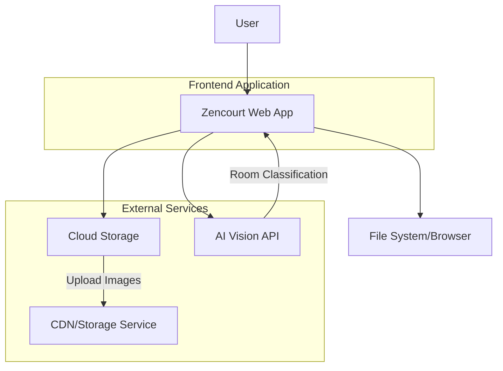
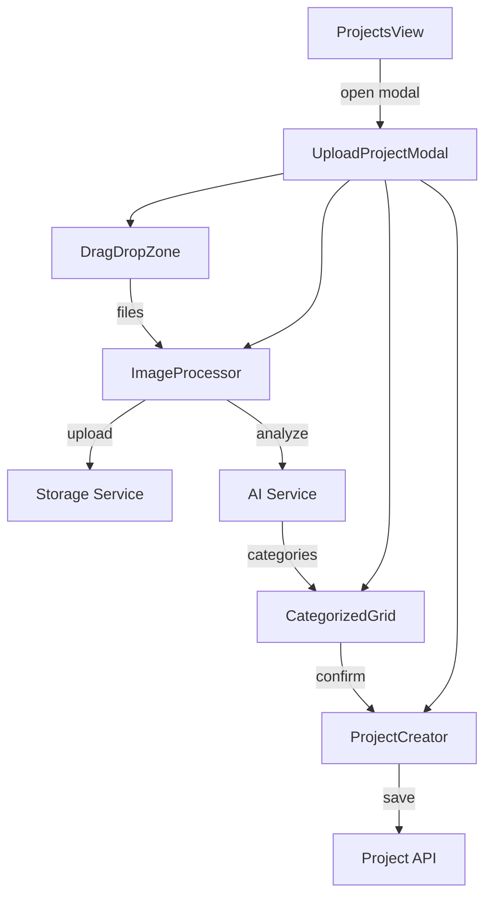
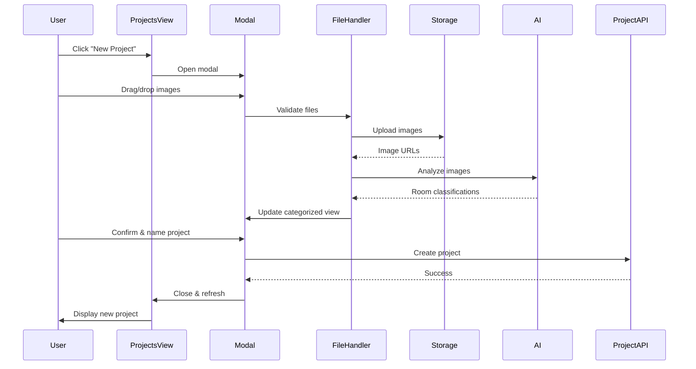

# Design Document

## Overview

This design specifies the implementation of an AI-powered property image upload and categorization system for Zencourt. The feature enables users to create new property video projects by uploading multiple images via drag-and-drop, which are then automatically sorted by room type using AI image analysis.

### Key Components
1. **Empty State UI** - Displayed when no projects exist
2. **Upload Modal** - Dialog interface for image upload and management
3. **Drag-and-Drop Zone** - Interactive file upload area with visual feedback
4. **Image Processing Pipeline** - Client-side upload and AI analysis orchestration
5. **Categorized Image Grid** - Display grouped images by detected room type
6. **Project Creation Flow** - Save categorized images as a new project

### Technical Approach
- **Frontend-driven workflow** with modal state management
- **Browser File API** for drag-and-drop and file selection
- **AI Vision API** integration for room classification (OpenAI Vision or similar)
- **Optimistic UI patterns** with loading and error states
- **Local state management** using React hooks

## Architecture

### System Context



### Component Architecture



### Data Flow



## Components and Interfaces

### 1. ProjectsView Component (Modified)

**File:** `src/components/ProjectsView.tsx`

**Responsibilities:**
- Display empty state when no projects exist
- Show project grid when projects are available
- Open upload modal on "New Project" button click
- Refresh project list after new project creation

**State:**
```typescript
interface ProjectsViewState {
  projects: Project[];
  filter: "all" | "vertical" | "landscape";
  isUploadModalOpen: boolean;
  isLoading: boolean;
}
```

**Key Changes:**
- Remove hardcoded example projects array
- Add conditional rendering: empty state vs. project grid
- Add modal open/close state management
- Add project refresh callback

### 2. EmptyState Component (New)

**File:** `src/components/EmptyState.tsx`

**Purpose:** Display when no projects exist, encouraging project creation.

**Props:**
```typescript
interface EmptyStateProps {
  onCreateProject: () => void;
}
```

**UI Elements:**
- Illustration or icon
- Heading: "No projects yet"
- Description: "Create your first AI-generated property video"
- Primary CTA button: "Create New Project"

### 3. UploadProjectModal Component (New)

**File:** `src/components/UploadProjectModal.tsx`

**Purpose:** Main orchestrator for the upload and categorization workflow.

**Props:**
```typescript
interface UploadProjectModalProps {
  isOpen: boolean;
  onClose: () => void;
  onProjectCreated: (project: Project) => void;
}
```

**State:**
```typescript
interface UploadModalState {
  step: "upload" | "categorizing" | "review" | "naming";
  uploadedFiles: File[];
  imageData: ImageData[];
  categorizedImages: CategorizedImages;
  projectName: string;
  isProcessing: boolean;
  error: string | null;
}

interface ImageData {
  id: string;
  file: File;
  previewUrl: string;
  uploadStatus: "pending" | "uploading" | "uploaded" | "error";
  uploadUrl?: string;
  category?: string;
  confidence?: number;
  error?: string;
}

interface CategorizedImages {
  [category: string]: ImageData[];
}
```

**Sub-components:**
- `DragDropZone` - File upload interface
- `UploadProgress` - Progress indicator during upload
- `CategorizedImageGrid` - Display sorted images
- `ProjectNameInput` - Final step to name the project

### 4. DragDropZone Component (New)

**File:** `src/components/DragDropZone.tsx`

**Purpose:** Handle drag-and-drop and click-to-upload file selection.

**Props:**
```typescript
interface DragDropZoneProps {
  onFilesSelected: (files: File[]) => void;
  maxFiles?: number;
  acceptedFormats?: string[];
  isDisabled?: boolean;
}
```

**State:**
```typescript
interface DragDropState {
  isDragging: boolean;
  error: string | null;
}
```

**Implementation Details:**
- Use HTML5 drag-and-drop events: `onDragEnter`, `onDragOver`, `onDragLeave`, `onDrop`
- Hidden file input with `multiple` attribute
- File validation: type, size, count
- Visual feedback states: default, hover, active, error

**Accepted Formats:** `.jpg, .jpeg, .png, .webp`

**Max File Size:** 10MB per file

**Max Files:** 50 images

### 5. ImageProcessor Service (New)

**File:** `src/services/imageProcessor.ts`

**Purpose:** Handle image upload and AI analysis coordination.

**Interface:**
```typescript
interface ImageProcessorService {
  uploadImages(files: File[]): Promise<UploadResult[]>;
  analyzeImages(imageUrls: string[]): Promise<AnalysisResult[]>;
  categorizeImages(analysisResults: AnalysisResult[]): CategorizedImages;
}

interface UploadResult {
  id: string;
  url: string;
  status: "success" | "error";
  error?: string;
}

interface AnalysisResult {
  id: string;
  imageUrl: string;
  category: RoomCategory;
  confidence: number;
  alternativeCategories?: Array<{
    category: RoomCategory;
    confidence: number;
  }>;
}

type RoomCategory =
  | "exterior-front"
  | "exterior-backyard"
  | "living-room"
  | "kitchen"
  | "dining-room"
  | "bedroom"
  | "bathroom"
  | "garage"
  | "office"
  | "laundry-room"
  | "basement"
  | "other";
```

**Methods:**

1. **uploadImages(files: File[]): Promise<UploadResult[]>**
   - Upload files to cloud storage (e.g., AWS S3, Cloudflare R2, Vercel Blob)
   - Return signed URLs for each uploaded image
   - Handle upload errors per-file

2. **analyzeImages(imageUrls: string[]): Promise<AnalysisResult[]>**
   - Send image URLs to AI vision API
   - Process responses and extract room categories
   - Handle API rate limits and errors
   - Return structured analysis results

3. **categorizeImages(analysisResults: AnalysisResult[]): CategorizedImages**
   - Group images by detected category
   - Number duplicate room types (Bedroom 1, Bedroom 2, etc.)
   - Sort categories in logical order (Exterior → Living areas → Bedrooms → Bathrooms → Other)

### 6. AIVisionService (New)

**File:** `src/services/aiVision.ts`

**Purpose:** Integrate with AI vision API for room classification.

**API Options:**
1. **OpenAI Vision API** (GPT-4 Vision)
2. **Google Cloud Vision API**
3. **AWS Rekognition**
4. **Custom trained model**

**Recommended: OpenAI Vision API**

**Interface:**
```typescript
interface AIVisionService {
  classifyRoom(imageUrl: string): Promise<RoomClassification>;
  classifyRoomBatch(imageUrls: string[]): Promise<RoomClassification[]>;
}

interface RoomClassification {
  category: RoomCategory;
  confidence: number;
  reasoning?: string;
  features?: string[];
}
```

**Implementation:**
```typescript
async function classifyRoom(imageUrl: string): Promise<RoomClassification> {
  const prompt = `
    Analyze this real estate property image and classify the room type.

    Possible categories:
    - exterior-front: Front view of house/building
    - exterior-backyard: Backyard, patio, or rear exterior
    - living-room: Living room or family room
    - kitchen: Kitchen or kitchenette
    - dining-room: Dining room or dining area
    - bedroom: Bedroom (any bedroom)
    - bathroom: Bathroom or powder room
    - garage: Garage or carport
    - office: Office or study
    - laundry-room: Laundry room or utility room
    - basement: Basement or cellar
    - other: Any other space (hallway, closet, etc.)

    Respond with JSON:
    {
      "category": "<category>",
      "confidence": <0-1>,
      "reasoning": "<brief explanation>",
      "features": ["<feature1>", "<feature2>"]
    }
  `;

  const response = await openai.chat.completions.create({
    model: "gpt-4-vision-preview",
    messages: [
      {
        role: "user",
        content: [
          { type: "text", text: prompt },
          { type: "image_url", image_url: { url: imageUrl } }
        ]
      }
    ],
    max_tokens: 300
  });

  return JSON.parse(response.choices[0].message.content);
}
```

### 7. CategorizedImageGrid Component (New)

**File:** `src/components/CategorizedImageGrid.tsx`

**Purpose:** Display images grouped by detected room category.

**Props:**
```typescript
interface CategorizedImageGridProps {
  categorizedImages: CategorizedImages;
  onImageClick?: (image: ImageData) => void;
  onCategoryChange?: (imageId: string, newCategory: string) => void;
  isEditable?: boolean;
}
```

**Features:**
- Category headers with image counts
- Thumbnail grid within each category
- Drag-and-drop between categories (optional)
- Click to preview full-size image
- Loading states for images still processing
- Error states for failed images

### 8. StorageService (New)

**File:** `src/services/storage.ts`

**Purpose:** Handle file uploads to cloud storage.

**Recommended: Vercel Blob Storage** (seamless Next.js integration)

**Alternative: AWS S3 with presigned URLs**

**Interface:**
```typescript
interface StorageService {
  uploadFile(file: File, folder: string): Promise<string>;
  uploadFiles(files: File[], folder: string): Promise<UploadResult[]>;
  deleteFile(url: string): Promise<void>;
}
```

**Implementation with Vercel Blob:**
```typescript
import { put } from '@vercel/blob';

async function uploadFile(file: File, folder: string): Promise<string> {
  const blob = await put(`${folder}/${file.name}`, file, {
    access: 'public',
  });
  return blob.url;
}
```

### 9. Project Data Model

**Type Definitions:**

```typescript
interface Project {
  id: string;
  title: string;
  createdAt: Date;
  updatedAt: Date;
  status: "draft" | "processing" | "rendered";
  format: "vertical" | "landscape";
  platform: string[];
  subtitles: boolean;
  images: ProjectImage[];
  video?: {
    url: string;
    duration: number;
    thumbnail: string;
  };
}

interface ProjectImage {
  id: string;
  url: string;
  category: string;
  order: number;
  metadata?: {
    width: number;
    height: number;
    format: string;
    size: number;
  };
}
```

## Data Models

### Room Category Mapping

```typescript
const ROOM_CATEGORIES = {
  "exterior-front": {
    label: "Exterior - Front",
    icon: "Home",
    order: 1,
    color: "#10b981"
  },
  "exterior-backyard": {
    label: "Exterior - Backyard",
    icon: "Trees",
    order: 2,
    color: "#10b981"
  },
  "living-room": {
    label: "Living Room",
    icon: "Sofa",
    order: 3,
    color: "#3b82f6"
  },
  "kitchen": {
    label: "Kitchen",
    icon: "ChefHat",
    order: 4,
    color: "#f59e0b"
  },
  "dining-room": {
    label: "Dining Room",
    icon: "Utensils",
    order: 5,
    color: "#8b5cf6"
  },
  "bedroom": {
    label: "Bedroom",
    icon: "Bed",
    order: 6,
    color: "#ec4899"
  },
  "bathroom": {
    label: "Bathroom",
    icon: "Bath",
    order: 7,
    color: "#06b6d4"
  },
  "garage": {
    label: "Garage",
    icon: "Car",
    order: 8,
    color: "#6366f1"
  },
  "office": {
    label: "Office/Study",
    icon: "Briefcase",
    order: 9,
    color: "#14b8a6"
  },
  "laundry-room": {
    label: "Laundry Room",
    icon: "WashingMachine",
    order: 10,
    color: "#a855f7"
  },
  "basement": {
    label: "Basement",
    icon: "Warehouse",
    order: 11,
    color: "#64748b"
  },
  "other": {
    label: "Other",
    icon: "MoreHorizontal",
    order: 12,
    color: "#94a3b8"
  }
} as const;
```

### Duplicate Room Numbering Logic

```typescript
function numberDuplicateRooms(categorizedImages: CategorizedImages): CategorizedImages {
  const numbered: CategorizedImages = {};

  for (const [category, images] of Object.entries(categorizedImages)) {
    if (images.length === 1) {
      numbered[category] = images;
    } else if (["bedroom", "bathroom"].includes(category)) {
      // Number bedrooms and bathrooms
      images.forEach((img, index) => {
        const numberedCategory = `${category}-${index + 1}`;
        numbered[numberedCategory] = [img];
      });
    } else {
      // Keep multiple images in same category for other room types
      numbered[category] = images;
    }
  }

  return numbered;
}
```

## Error Handling

### Error Types and Strategies

1. **File Validation Errors**
   - Invalid file type → Show inline error, allow user to remove invalid files
   - File too large → Show warning, offer compression or removal
   - Too many files → Prevent upload, show max limit message

2. **Upload Errors**
   - Network failure → Retry with exponential backoff
   - Storage quota exceeded → Alert user, suggest removing files
   - Individual file upload failure → Mark file as error, allow retry

3. **AI Analysis Errors**
   - API rate limit → Queue requests, show progress
   - API unavailable → Fallback to manual categorization
   - Low confidence classification → Place in "Other" category, allow manual reclassification

4. **Project Creation Errors**
   - Database error → Show error message, allow retry
   - Validation error → Highlight problematic field
   - Network timeout → Auto-retry with loading state

### Error UI Components

```typescript
interface ErrorState {
  type: "validation" | "upload" | "analysis" | "creation";
  message: string;
  retryable: boolean;
  affectedItems?: string[];
}

// Error display component
function ErrorMessage({ error, onRetry }: { error: ErrorState; onRetry?: () => void }) {
  return (
    <div className="bg-red-50 border border-red-200 rounded-lg p-4">
      <p className="text-red-800">{error.message}</p>
      {error.retryable && (
        <button onClick={onRetry} className="mt-2 text-red-600 underline">
          Try again
        </button>
      )}
    </div>
  );
}
```

## Testing Strategy

### Unit Tests

1. **File Validation**
   - Test accepted file types
   - Test file size limits
   - Test max file count

2. **Image Processor**
   - Test upload result handling
   - Test categorization logic
   - Test duplicate room numbering

3. **Room Category Mapping**
   - Test category ordering
   - Test label formatting
   - Test icon mapping

### Integration Tests

1. **Upload Flow**
   - Drag-and-drop file selection
   - Click-to-upload file selection
   - File validation feedback
   - Upload progress tracking

2. **AI Analysis Integration**
   - Mock AI API responses
   - Test successful categorization
   - Test error handling
   - Test retry logic

3. **Project Creation**
   - Test modal workflow
   - Test project data structure
   - Test persistence
   - Test list refresh

### E2E Tests

1. **Complete Project Creation Flow**
   - Open modal
   - Upload images
   - Wait for categorization
   - Name project
   - Verify project appears in list

2. **Error Recovery**
   - Simulate upload failure
   - Verify retry functionality
   - Simulate AI API failure
   - Verify fallback behavior

## Performance Considerations

### Optimization Strategies

1. **Image Upload Optimization**
   - Concurrent uploads (max 5 at a time)
   - Client-side image compression before upload
   - Progress tracking per file
   - Abort on modal close

2. **AI Analysis Optimization**
   - Batch API requests (up to 10 images per request if supported)
   - Cache results to avoid re-analysis
   - Parallel processing where possible
   - Timeout handling (30 seconds per image)

3. **UI Performance**
   - Virtual scrolling for large image grids (if >50 images)
   - Lazy load image thumbnails
   - Debounce drag-and-drop events
   - Use React.memo for image components

4. **Bundle Size**
   - Lazy load modal component
   - Code split AI service
   - Optimize image preview generation

### Performance Metrics

- **Upload Time:** < 2 seconds per image (5MB average)
- **AI Analysis:** < 5 seconds per image
- **Modal Load Time:** < 500ms
- **Image Preview Generation:** < 200ms
- **Project Creation:** < 1 second

## Security Considerations

1. **File Upload Security**
   - Validate file types on client AND server
   - Scan uploaded files for malware (server-side)
   - Generate unique file names to prevent overwriting
   - Use signed URLs with expiration

2. **API Key Protection**
   - Store AI API keys in environment variables
   - Use server-side API routes to proxy requests
   - Never expose keys in client-side code

3. **Data Privacy**
   - Don't send personally identifiable information to AI
   - Use secure HTTPS connections
   - Implement proper CORS policies
   - Rate limit API requests

## Accessibility

### WCAG 2.1 AA Compliance

1. **Keyboard Navigation**
   - Tab through all interactive elements
   - Enter to open modal
   - Escape to close modal
   - Arrow keys to navigate image grid
   - Space to select images

2. **Screen Reader Support**
   - ARIA labels on drag-drop zone
   - ARIA live regions for upload progress
   - ARIA announcements for categorization completion
   - Alt text for all images

3. **Visual Accessibility**
   - High contrast borders on drag states
   - Focus indicators on interactive elements
   - Loading spinners with labels
   - Error messages with icons

4. **Mobile Accessibility**
   - Touch targets min 44x44px
   - Swipe gestures for image preview
   - Responsive modal sizing
   - Accessible file picker on mobile

## Responsive Design

### Breakpoints

- **Mobile:** < 640px (default)
- **Tablet:** 640px - 1024px (sm:)
- **Desktop:** > 1024px (lg:)

### Modal Sizing

```typescript
// Mobile: Full screen modal
// Tablet: 90% viewport width, max 600px
// Desktop: Fixed 800px width

className="w-full h-full sm:w-[90vw] sm:max-w-[600px] sm:h-auto lg:w-[800px]"
```

### Grid Layout

```typescript
// Mobile: 2 columns
// Tablet: 3 columns
// Desktop: 4 columns per category

className="grid grid-cols-2 sm:grid-cols-3 lg:grid-cols-4 gap-4"
```

## Future Enhancements

1. **Advanced AI Features**
   - Detect and suggest property highlights
   - Auto-generate video narration script
   - Identify best thumbnail candidates
   - Detect image quality issues

2. **Manual Editing**
   - Drag to reorder images within categories
   - Merge/split categories
   - Custom category creation
   - Bulk category reassignment

3. **Collaboration**
   - Share project drafts
   - Comment on specific images
   - Approval workflows

4. **Analytics**
   - Track upload success rates
   - Monitor AI accuracy
   - Measure time-to-project-creation
